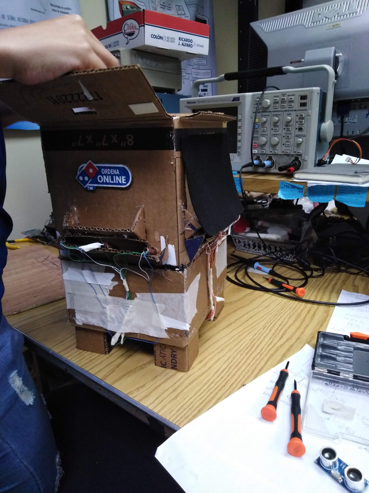
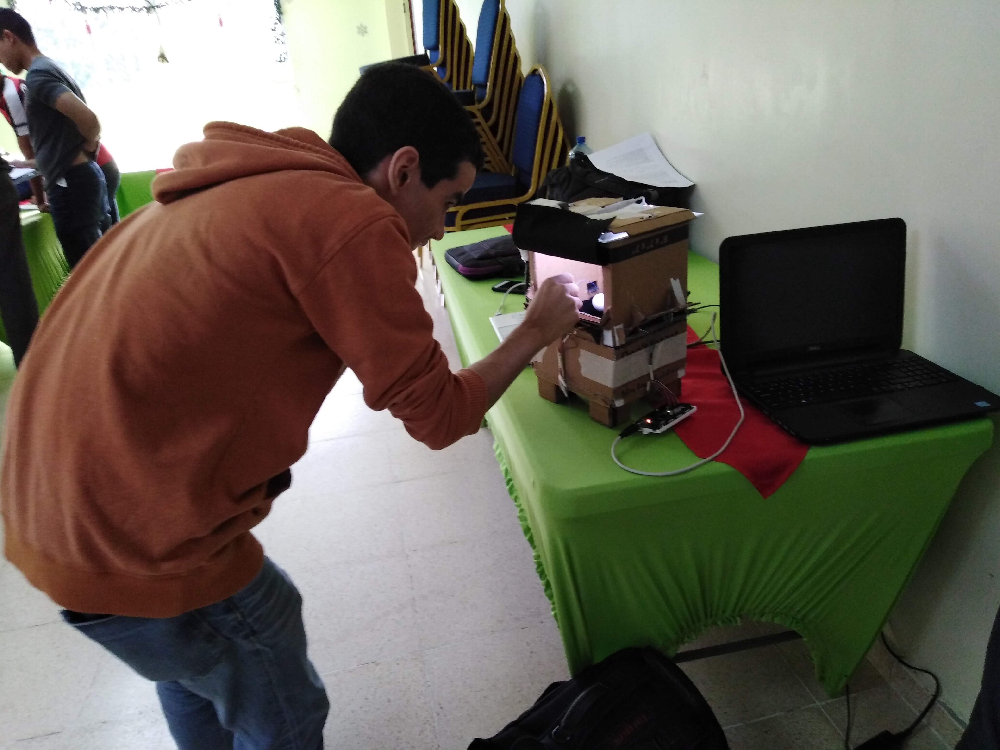

# ISL-Relative-positioning-system.
Implementation of two-dimensional positioning system using (Light Dependent Resistor), Arduino and Matplotlib. Project developed by Intelligent Systems Laboratory.

Project Members:
>Gabriel Marzullo,Fatima Batista, Josue Rodriguez.

> Final Product

Logistical info:

Team Name: Intelligent-Systems-Laboratory

Organization: Technological University of Panama

Country: Panama

Contact person: Danilo Caceres

Email: danilo.caceres@utp.ac.pa
